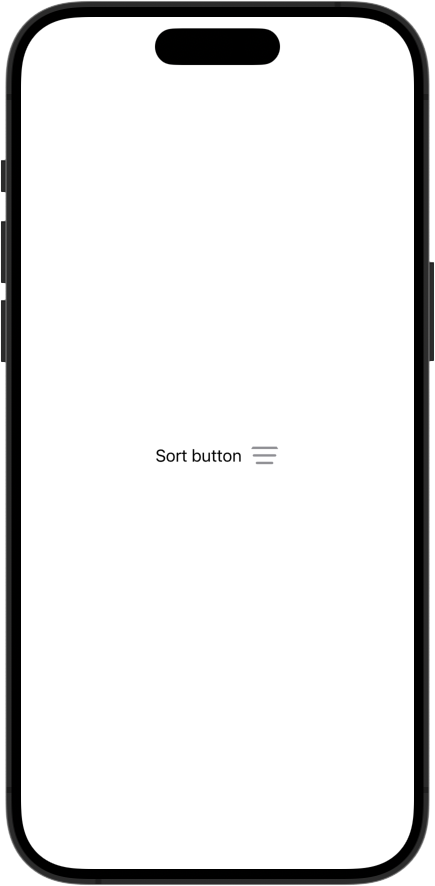
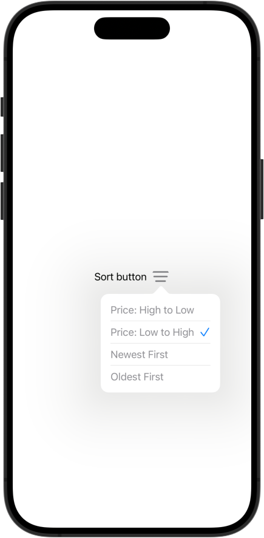

# Popover Button

`PopoverButton` is a SwiftUI component that turns any view into a button, which, when tapped, displays a popover. The items to be displayed in the popover are passed from the outside and displayed in a list format.




## Features

- Turns any view into a button and displays a list-style popover.

## Installation

To install `PopoverButton` using Swift Package Manager, add the following to your `Package.swift` file:

```swift
dependencies: [
    .package(url: "https://github.com/sakes9/PopoverButton.git", from: "{{ version }}")
]
```

Then, add `PopoverButton` as a dependency to your target:

```swift
.target(
    name: "YourTargetName",
    dependencies: ["PopoverButton"]
)
```

## Usage

Here's a basic example of how to use `PopoverButton` in your SwiftUI view:

```swift
import PopoverButton
import SwiftUI

struct ContentView: View {
    let options: [PopoverButtonOption] = [
        PopoverButtonOption(id: 1, title: "Price: High to Low"),
        PopoverButtonOption(id: 2, title: "Price: Low to High"),
        PopoverButtonOption(id: 3, title: "Newest First"),
        PopoverButtonOption(id: 4, title: "Oldest First")
    ]

    @State private var selectedOptionId: Int? = 2

    var body: some View {
        HStack {
            Text("Sort button")
            PopoverButton(action: { option in
                              print("Selected option: \(option)")
                          },
                          options: options,
                          selectedOptionId: $selectedOptionId,
                          content: {
                              Image(systemName: "line.3.horizontal.decrease")
                                  .resizable()
                                  .aspectRatio(contentMode: .fit)
                                  .frame(width: 30, height: 30)
                                  .foregroundColor(.gray)
                                  .clipShape(Circle())
                          })
        }
        .padding(.horizontal)
    }
}
```

### Parameters

- `action`: A callback that is called when an option is selected. It takes the selected `PopoverButtonOption` instance as an argument.
- `options`: An array of `PopoverButtonOption` instances that contain the options to display in the popover.
- `selectedOptionId`: A binding to the selected option's ID. This is used to checked the selected option in the popover.
